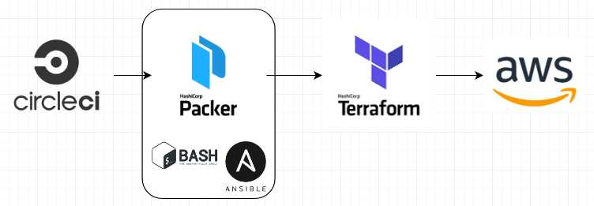

# btci

[](https://circleci.com/gh/twade01/btci)

## Purpose
To create a simple application deployment with Terraform, Packer, CircleCI and AWS.

## Pipeline Overview

### Workflow


### Pipeline


## Architecture Overview


## Source code structure

### CircleCI
```
├── .circleci
│   ├── config.yml                       <-- Circleci config
```

### Packer
```
├── packer
│   ├── packer.json                      <-- Packer template
```

### Ansible
```
├── ansible
│   ├── install-btcd.yml                    <-- Ansible playbook file for installing btcd
│   ├── requirements.yaml                   <-- Ansible Galaxy requirements containing additional Roles to be used
│   └── roles                               <-- Roles
│       ├── common                          <-- Common Role
│           ├── tasks                       <-- Common Role Tasks
│               ├── main.yml                <-- Upgrades all packages through ``apt``
```

### Terraform
```
├── terraform
│   ├── main.tf                           <-- Main tasks
│   ├── terraform.tfvars                  <-- Env / Region vars
│   ├── variables.tf                      <-- Instantiate vars
│   └── infrastructure                    <-- Infrastructure module base dir
│       ├── main.tf                       <-- Main infrastructure tasks
│       ├── output.tf                     <-- Outputs
│       ├── variables.tf                  <-- Instantiate vars
│       ├── instances                     <-- Instance module base dir
│       ├    ├── aws_ami.tf               <-- AWS AMI resource
│       ├    ├── btcd_host.tf             <-- AWS EC2 resource
│       ├    ├── load_balancer.tf         <-- AWS ELB resource
│       ├    ├── output.tf                <-- Outputs
│       ├    ├── security_groups.tf       <-- AWS Security Group resources
│       ├    ├── variables.tf             <-- Instantiate vars
│       ├── network                       <-- Network module base dir
│           ├── eips.tf                   <-- AWS EIP resources
│           ├── gateways.tf               <-- AWS Gateway resources
│           ├── output.tf                 <-- Outputs
│           ├── routes.tf                 <-- AWS Routes resources
│           ├── subnets.tf                <-- AWS Subnet resources
│           ├── variables.tf              <-- Instantiate vars
│           ├── vpc.tf                    <-- AWS VPC resource
```

### Scripts
```
├── scripts
│   ├── clean-apt.sh                    <-- Clean apt packages
│   ├── configure-timezone.sh           <-- Set timezone
│   └── update-apt.sh                   <-- Apt update and upgade
```
